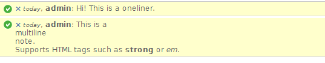
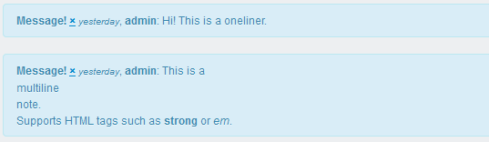
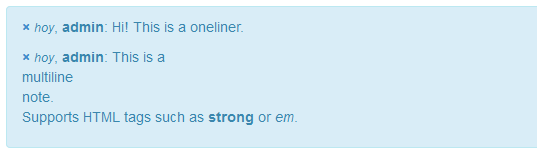

django-jot
==========

Simple Django application to take notes.

## Basic setup.  

### Installation.

Simply add `jot` to your `INSTALLED_APPS` in your project's `settings.py` file.  
And something along this line to your project's `urls.py` file: `url(r'^jot-stuff/', include('jot.urls'))`  

### OneLiners and Notes.

Let's say you need to take notes on you model objects. Sometimes one would add an extra field just to take notes but you can't track who wrote the note, when it was written or anything at all, instead using these at least it's easier to keep track of what/when something was written by whom. Also, it's possible to have personal items just so you can save all your precious post-its to do something more creative like a [Mario](http://www.flickr.com/photos/36821880@N07/4289903023/lightbox/) or something like that.  
There are two types of content you can use:  
* **OneLiner**, for quick stuff.  
* **Notes**, for a more detailed entry about the stuff we're commenting on.  

### Using it.

Simply inherit `JotNotifications` in your app's `ModelAdmin`.  
For example:

    from jot.admin import JotNotifications
    
    [...]
    
    class SomethingAdmin(JotNotifications, admin.ModelAdmin):
      pass

Also, you can use the setting `JOT_RELATIONSHIPS` (which can be a `tuple` or a `list`) contanining the `app.model`s you want to work with.  
For Example

    JOT_RELATIONSHIPS = ('something.Bla',
                         'something.Ble',
                         'something.Bli',
                        )

#### yay, screenshots!

If you ever used the Django admin, probably you already know how a `message` looks like, but just for the kicks:

Django Admin:  

Django Admin with [django-suit](http://djangosuit.com/):

Django Admin with Bootstrap:

## Notes

Until Django releases the version 1.6 as the stable, this project requires that you have jQuery in your static files, such as [django-jquery](https://pypi.python.org/pypi/django-jquery/1.9.1), simply because the jQuery version shipped with <=1.5.2 is way outdated (1.4.2). 
